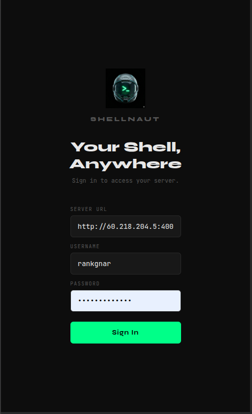
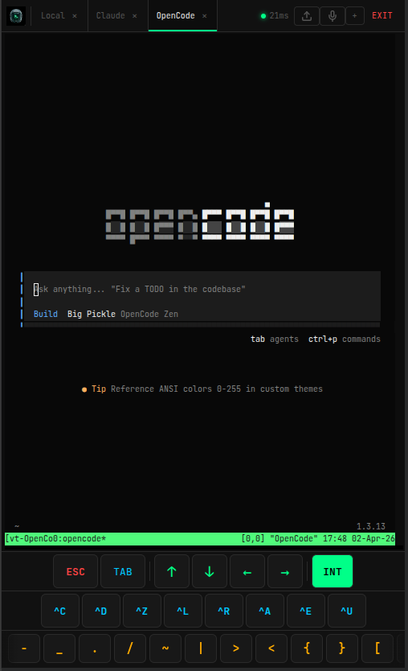
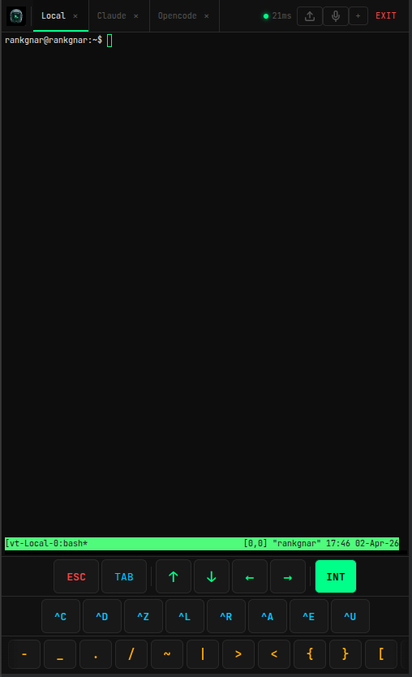
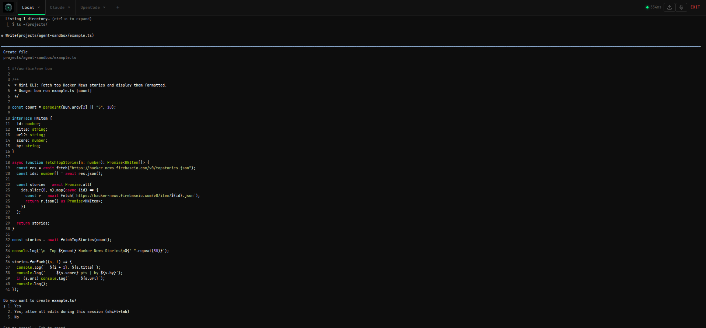

<p align="center">
  
</p>

<h1 align="center">Shellnaut</h1>

<p align="center">
  <b>Your terminal, anywhere. Self-hosted, no middleman.</b>
</p>

<p align="center">
  <a href="LICENSE"></a>
  <a href="#"></a>
  <a href="#"></a>
  <a href="#"></a>
  <a href="#"></a>
</p>

---

SSH from a phone is painful. Third-party terminal apps require trusting someone else with your server access.

**Shellnaut** gives you a real terminal in your browser — with persistent sessions, tabs, AI coding tools, and auto-reconnect. Install it on your server, open it from your phone, and you're in. No middleman. You own everything.

---

## Screenshots

<p align="center">
  
  &nbsp;&nbsp;
  
  &nbsp;&nbsp;
  
</p>
<p align="center"><sub>Login &nbsp;|&nbsp; Terminal on mobile &nbsp;|&nbsp; Session manager</sub></p>

<br>

<p align="center">
  
</p>
<p align="center"><sub>Desktop: multi-tab terminal</sub></p>

---

## Features

- **Persistent sessions** — Powered by tmux. Close your browser, come back later, your session is still running
- **Session manager** — See all active sessions, reattach or kill from one place
- **Multi-tab** — Open bash, Claude, Gemini, Codex, OpenCode, or any CLI in separate tabs
- **Auto-install** — AI coding CLIs are installed automatically on first use
- **PWA** — Install on iOS/Android home screen as a native-feeling app
- **File upload** — Upload files directly from your device into the terminal session
- **Mobile toolbar** — TAB, ESC, Ctrl+C, arrow keys, special chars — all without a physical keyboard
- **Auto-reconnect** — Reconnects automatically on connection loss, reattaches to the same session
- **Inactivity timeout** — Idle sessions are automatically cleaned up (configurable)
- **Latency indicator** — Live ping display in the header

### Security

- **Not exposed to the internet** — Server binds to your Tailscale IP only, unreachable from public IPs
- **Firewall** — UFW configured automatically: only SSH and Tailscale traffic allowed
- **Runs as your user, not root** — The installer ensures the server never runs as root
- **Username/password auth** — Password stored as scrypt hash, never in plaintext
- **Exponential backoff** — 5 failed attempts triggers lockout (1min, 2min, 4min... up to 30min)
- **Command allowlist** — Only whitelisted commands can be spawned
- **Session limits** — Configurable max concurrent sessions
- **Security headers** — CSP, X-Frame-Options, HSTS, no-referrer
- **.env protected** — Credentials file set to 0600 (owner-only)

---

## Installation

You need a server (VPS, Raspberry Pi, any Linux machine). If you don't have one, providers like [Hetzner](https://www.hetzner.com/cloud/), [DigitalOcean](https://www.digitalocean.com/) or [Contabo](https://contabo.com/) offer VPS from ~$4/month.

### Step 1 (Optional): Secure your server

> This step is **optional but recommended** if you're running on a fresh VPS. If your server is already secured or you're installing locally, skip to Step 2.

[vps-secure-setup](https://github.com/rankgnar/vps-secure-setup) is a **separate project** that hardens your server — it sets up Tailscale (private encrypted network), disables root SSH, and configures a firewall.

```bash
git clone https://github.com/rankgnar/vps-secure-setup.git
cd vps-secure-setup
sudo bash install-wizard.sh
```

Once done, you'll have a Tailscale IP (looks like `100.x.x.x`) and a secure user to connect with.

**Important:** When you're done, go back to your home directory before continuing:

```bash
cd ~
```

### Step 2: Connect to your server

If you set up Tailscale in Step 1, install [Tailscale](https://tailscale.com/download) on your phone/laptop, sign in with the same account, and connect via SSH:

```bash
ssh your-user@100.x.x.x
```

If you skipped Step 1, just SSH into your server however you normally do.

### Step 3: Install Shellnaut

Clone the repo and run the interactive installer:

```bash
cd ~
git clone https://github.com/rankgnar/shellnaut.git
cd shellnaut
sudo bash install.sh
```

The wizard will:
1. Verify Tailscale is running and get your private IP
2. Install Node.js if needed
3. Install tmux if needed
4. Install dependencies and build the client
5. Ask you to create a username and password
6. Start the server with PM2 as your user (not root)
7. Configure UFW firewall (block everything except SSH + Tailscale)
8. Show you the URL to connect

At the end, it gives you the URL to open in your browser.

### That's it

Open `http://<your-tailscale-ip>:3001` (or `http://<your-server-ip>:3001`) from any device. Log in and you have a full terminal in your browser.

---

## Install as Mobile App

Shellnaut works as a PWA — you can install it on your phone and it looks like a native app.

1. Open `http://<your-tailscale-ip>:3001` in your phone's browser
2. **iPhone/iPad:** Tap Share > "Add to Home Screen"
3. **Android:** Tap the menu (three dots) > "Install app" or "Add to Home Screen"

The Shellnaut icon will appear on your home screen. Tap it to open in full screen.

---

## Usage

1. **Log in** — Enter your server URL, username, and password
2. **Create a session** — Type a name and press Enter (or tap Open)
3. **Use the terminal** — It's a real shell. Run any command
4. **Switch tabs** — Tap the tab bar at the top, or swipe left/right on mobile
5. **Upload files** — Tap the upload icon in the header to send files from your device to the server
6. **Close the browser** — Your sessions keep running. Come back later and they're still there

### Session manager

Press **+** to open the session manager:
- See all running sessions
- Tap a session to reattach
- Tap the trash icon to delete a session

Sessions are automatically killed after 30 minutes of inactivity (configurable).

---

## Configuration

All settings are in `.env` (created during install). You can edit it manually:

```bash
cd ~/shellnaut
nano .env
```

Then restart: `pm2 restart shellnaut`

| Variable | Default | What it does |
|:---------|:--------|:------------|
| `HOST` | `0.0.0.0` | Bind address — set to your Tailscale IP to block public access |
| `PORT` | `3001` | Port the server runs on |
| `DEFAULT_CMD` | `bash` | Default shell when creating a session |
| `MAX_SESSIONS` | `10` | Max sessions running at the same time |
| `INACTIVITY_TIMEOUT` | `30` | Minutes before an idle session is killed |
| `ALLOWED_COMMANDS` | `bash,sh,zsh,claude,gemini,...` | Commands users are allowed to run |

---

## Troubleshooting

**"Cannot reach server"**
- Make sure the server is running: `pm2 status shellnaut`
- Make sure Tailscale is connected on both devices: `tailscale status`
- Verify Shellnaut is listening: `curl -s http://<your-tailscale-ip>:3001/ping`

**"tmux is required"**
- Install it: `sudo apt install tmux`

**"Invalid credentials"**
- Re-run `cd ~/shellnaut && npm run setup` to set new credentials
- Then restart: `pm2 restart shellnaut`

**"Too many failed attempts"**
- Wait for the lockout to expire (starts at 1 minute, doubles each time)
- Or restart to reset: `pm2 restart shellnaut`

**Session disappeared**
- Sessions are killed after `INACTIVITY_TIMEOUT` minutes with no one connected
- Increase the value in `.env` if you need longer sessions

---

## Uninstall

Shellnaut doesn't install system services or modify your shell. To remove it completely:

```bash
pm2 stop shellnaut
pm2 delete shellnaut
pm2 save
rm -rf ~/shellnaut    # or wherever you cloned it
rm -rf ~/uploads
```

If you installed PM2 only for Shellnaut and want to remove it too:

```bash
sudo npm uninstall -g pm2
```

---

## License

MIT
